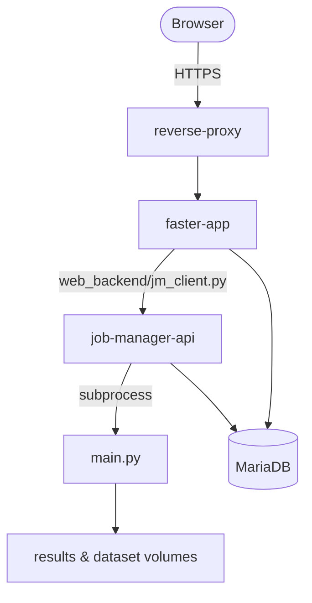

# FASTER

[](LICENSE)
[](pyproject.toml)
[](#documentation)

**A browser-based platform for running, managing, and reviewing federated-learning experiments.**

FASTER pairs a single-page web dashboard with a DB-backed application layer and a bundled Job Manager that queues training jobs, launches workers, and persists shared state in MariaDB. Set up an experiment in the browser, submit it, watch it run, and export the results — without losing sight of the underlying configuration or artifacts.

> Full reference documentation (architecture, subsystems, API) is built with Sphinx — see [Documentation](#documentation).

## Features

- **Browser workspace** for experiment setup, run submission, live monitoring, history, datasets, scenarios, and ZIP export.
- **Simple and Advanced** setup flows — custom model code, round-level training schedules, and per-round client allocation.
- **Built-in datasets**: MedMNIST family, FashionMNIST, CIFAR-10/100, plus custom tabular, NPZ, and image-folder datasets.
- **DB-backed auth** with roles and admin/job CLIs that run inside the container — no host-side Python needed.
- **Job Manager** owns queueing, worker lifecycle, cancellation, and runtime metrics.

## Architecture

The supported runtime is the Docker Compose stack in [`docker-compose.yml`](docker-compose.yml):



| Service | Role |
| --- | --- |
| `reverse-proxy` | Terminates HTTPS and routes browser traffic. |
| `faster-app` | Serves the SPA, the backend API, and artifact exports; validates and persists runs, then delegates execution. |
| `job-manager-api` | Owns queueing, worker lifecycle, cancellation, and runtime metrics once a run is accepted. |
| `mariadb` | Stores users, runs, jobs, saved defaults, scenarios, alerts, and dataset metadata. |

The browser only ever talks to `faster-app`; `faster-app` is the sole client of the Job Manager, over a single shared service connection.

## Quick Start (Docker Compose)

No host-side Python or `uv` is required for normal use — the stack is self-contained.

**Prerequisites:** Docker Engine 24+, Compose v2+, OpenSSL, and an NVIDIA GPU + Container Toolkit.

> The default compose file declares `gpus: all` on `faster-app` and `job-manager-api`. On a CPU-only host, remove those `gpus: all` lines (and the `NVIDIA_*` env entries) from both services first.

**1. Configure the environment.**

```bash
cp .env.example .env
```

Edit `.env` and set, at minimum, long random secrets and the bootstrap accounts:

```bash
FL_SECRET_KEY=...
JM_JWT_SECRET=...

# These three must be identical
MARIADB_PASSWORD=...
FASTER_DB_PASSWORD=...
JM_DB_PASSWORD=...

FASTER_ADMIN_USERNAME=admin
FASTER_ADMIN_PASSWORD=StrongAdminPass123!

# Job Manager service account — keep its username distinct from the admin
JM_SERVICE_USERNAME=svc-faster
JM_SERVICE_PASSWORD=StrongServicePass123!
```

On first startup, `faster-app` seeds the admin and service account **only when the `users` table is empty**, so it never overrides an existing deployment. Passwords must satisfy the policy (≥10 chars; upper, lower, digit, special) or that account is skipped.

> `MARIADB_PASSWORD` is only read when the `mariadb_data` volume is first created. Changing it later has no effect on the stored password; to reset it, run `docker compose down -v` (this deletes the database) and start again.

**2. Generate local TLS certificates.**

```bash
mkdir -p certs
openssl req -x509 -newkey rsa:2048 -nodes -days 365 \
  -keyout certs/localhost.key -out certs/localhost.crt \
  -subj "/CN=localhost"
```

**3. Start the stack and open the dashboard.**

```bash
docker compose up -d --build
```

Go to `https://localhost:8443` and sign in with your `FASTER_ADMIN_*` credentials.

> If `faster-app` logs `JM service login failed`, the `JM_SERVICE_USERNAME` row is missing or its password does not match `JM_SERVICE_PASSWORD`.

## Usage

The dashboard covers the full workflow. The CLIs below run **inside the running `faster-app` container** (`docker compose exec`), which already carries the DB credentials and `uv` environment. To drive a remote stack, prefix any command with `docker -H ssh://user@server` — the remote host needs only the Docker CLI and SSH.

### Managing users

```bash
docker compose exec faster-app python3 -m auth.user_cli create --username alice --password 'Str0ng!Pass123'
docker compose exec faster-app python3 -m auth.user_cli set-role --username alice --role admin
docker compose exec faster-app python3 -m auth.user_cli list
docker compose exec faster-app python3 -m auth.user_cli delete --username alice
```

Always pass `--password` to stay non-interactive. Add `--allow-weak-password` to bypass strength checks **in local/dev only**.

### Running jobs from the CLI

Submit, list, attach, and cancel runs from the terminal — same pipeline as the UI (validated, recorded in the DB, queued, and shown in history). Every command takes `--user` (default `admin`); the account must already exist, and the **same role rules as the dashboard** apply: a normal user lists the queue and controls only their own runs; an admin controls every job.

```bash
# Submit a run; prints its run_id, job_id, and results path
docker compose exec faster-app python3 -m web_backend.job_cli submit --config config.yaml --user alice

# List active jobs (--all also includes done/failed/cancelled)
docker compose exec faster-app python3 -m web_backend.job_cli list --user alice

# Follow a run's logs live; Ctrl+C detaches (the run keeps going)
docker compose exec faster-app python3 -m web_backend.job_cli attach --user alice --run-id <RUN_ID>

# Cancel a queued or running job by id
docker compose exec faster-app python3 -m web_backend.job_cli cancel --user alice --job-id <JOB_ID>
```

A `run_id` identifies the run and its `results/<run_id>/` folder; a `job_id` identifies the queued job — both are printed by `submit`/`list`. In `list`, a non-admin sees other users' jobs masked (`(hidden)`) but keeps their queue position. `cancel` syncs the Faster run to `stopped` so the dashboard stays current.

### Worker entrypoint (debug only)

[`main.py`](main.py) is the training worker. Running it directly **bypasses** the Job Manager — the run is not queued, recorded, or visible in the dashboard. Use it only to debug a config in isolation:

```bash
docker compose exec faster-app python3 main.py --config config.yaml --save_path results/demo
```

## Configuration

Configuration comes from three sources, resolved in this order: **user-scoped saved defaults → shared/global defaults → bootstrap [`config.yaml`](config.yaml)**. Runtime environment lives in [`.env.example`](.env.example); persisted defaults, scenarios, runs, and job metadata live in MariaDB.

### Key environment variables

| Variable | Purpose |
| --- | --- |
| `FL_SECRET_KEY` / `JM_JWT_SECRET` | Token-signing secrets — use long random values. |
| `MARIADB_ROOT_PASSWORD` / `MARIADB_PASSWORD` | Shared MariaDB passwords. |
| `FASTER_DB_PASSWORD` / `JM_DB_PASSWORD` | How `faster-app` and `job-manager-api` authenticate as `faster_app`. Both must be set to the same value as `MARIADB_PASSWORD`. |
| `FASTER_ADMIN_USERNAME` / `FASTER_ADMIN_PASSWORD` | Bootstrap admin, seeded only when the users table is empty. |
| `JM_SERVICE_USERNAME` / `JM_SERVICE_PASSWORD` | `faster-app` → Job Manager service account, distinct from the admin. |

Tunables (`FASTER_DB_POOL_SIZE`, `JM_API_TIMEOUT`, upload caps, GPU overrides) ship with sensible defaults and are documented inline in [`.env.example`](.env.example).

### Job run-time limit

Each job is killed past a fixed wall-clock limit set by `job_timeout_seconds` in [`job_manager/config.yaml`](job_manager/config.yaml) — default **`36000`s (10 hours)**. Raise it for longer runs and restart `job-manager-api` to apply.

### Upload size limits

Dataset uploads pass two gates. The reverse proxy is the first one: `NGINX_CLIENT_MAX_BODY_SIZE` caps the request body it will accept and defaults to **`1024m`**. A rejected upload here surfaces as **HTTP 413**; raise the value and restart the stack to allow bigger archives. The app then applies two optional byte caps, both **`0` (unlimited)** by default: `FL_API_BODY_MAX_BYTES` for API request bodies and `FL_CUSTOM_DATASET_UPLOAD_MAX_BYTES` for streamed dataset uploads. All three live in [`.env.example`](.env.example).

### Datasets and models

Built-in datasets: `pathmnist`, `dermamnist`, `octmnist`, `bloodmnist`, `tissuemnist`, `pneumoniamnist`, `organamnist`, `organcmnist`, `organsmnist`, `fashionmnist`, `cifar10`, `cifar100`.

Custom datasets are accepted as **CSV/TSV** tabular data (numeric features, one label column, explicit `train`/`val`/`test` split column), **NPZ** image arrays, or **directory-based** image datasets with backend-generated metadata.

Setup has two model modes:

- **Simple** — built-in model path; the training split is spread across rounds automatically.
- **Advanced** — custom model code, explicit round-level training schedules, and optional manual per-round client allocation.

Only the federated training split varies across rounds; validation and test stay fixed and run every round. Manual round schedules must give one positive percentage per round summing to `100`; manual client schedules must give one percentage per client per round, each round summing to `100`. When churn makes clients inactive, the round's share is redistributed across eligible clients.

Custom model code must define `build_model(n_channels, n_classes)` returning a `torch.nn.Module`, plus a non-empty `MODEL_NAME` string. It is validated before launch.

## Documentation

The Sphinx reference site documents the architecture, the Job Manager subsystem, backend modules, and the API in depth.

It builds in a host environment managed with [`uv`](https://docs.astral.sh/uv/) against the locked `uv.lock` — always use `uv`, never `pip`. From the repository root, with Python `3.12.x` available:

```bash
uv sync
uv run make -C docs html
```

Open the generated `docs/_build/html/index.html`.

## Tests

The suite is written with `unittest` and run through `pytest`. It needs no database
and no running stack, integration tests use in-memory repository fakes.

```bash
uv sync
uv run pytest
```

Run a subset by path, for example `uv run pytest tests/unit`.

## Citation

If you use FASTER in academic work, cite it with the metadata in [CITATION.cff](CITATION.cff). GitHub turns that file into a ready-made citation under **Cite this repository**, in BibTeX or APA.

If your work uses the **FedGP** aggregation method, please also cite the paper that introduced it:

```bibtex
@inproceedings{fedgp,
  title     = {FedGP: Genetic Programming for Evolutionary Aggregation in
               Federated Learning with Non-IID Data},
  author    = {Pacioni, Elia and Fern\'{a}ndez de Vega, Francisco and Calvaresi, Davide},
  booktitle = {Applications of Evolutionary Computation},
  series    = {Lecture Notes in Computer Science},
  publisher = {Springer Nature Switzerland},
  pages     = {419--434},
  year      = {2025},
  doi       = {10.1007/978-3-031-90062-4_26},
  url       = {https://link.springer.com/chapter/10.1007/978-3-031-90062-4_26}
}
```

## Getting help

- **Questions and bugs**: [open an issue](https://github.com/HISTLab-hevs/FASTER/issues).
- **Security**: do not open an issue. See [SECURITY.md](SECURITY.md); reports go privately to elia.pacioni@hevs.ch or valerio.crocetti@hevs.ch.
- **Source**: <https://github.com/HISTLab-hevs/FASTER>

## Contributing

[CONTRIBUTING.md](CONTRIBUTING.md) covers setup, what to run before opening a pull request, and the parts of the repository that are easy to get wrong. [`docs/contributor_map.rst`](docs/contributor_map.rst) maps the repository by domain.

Participation is governed by the [code of conduct](CODE_OF_CONDUCT.md). Released changes are recorded in [CHANGELOG.md](CHANGELOG.md).

## License

FASTER is distributed under the terms of the [MIT License](LICENSE).

Third-party material, including the text the code of conduct is adapted from and what the dashboard loads from a CDN at runtime, is recorded in [NOTICE](NOTICE) together with a licence review of the dependencies.
